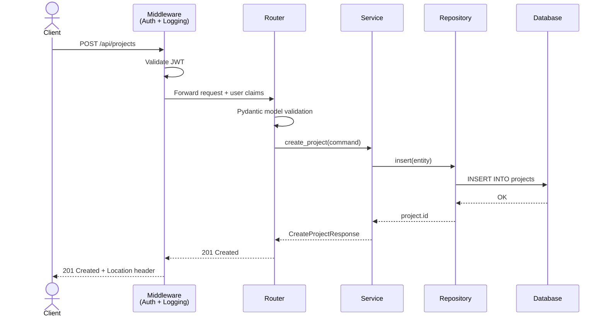

# Python API Documentation Skill

Produces three types of documentation output — always consistent, always idiomatic — for Python APIs (FastAPI, Flask, Django REST Framework):

1. **Google-Style Docstrings** — inline Python documentation (`Args`, `Returns`, `Raises`, `Yields`, `Example`, `Note`)
2. **README.md** — structured project/API README with setup, endpoints, auth, and usage examples
3. **Flow Diagrams** — Mermaid sequence or flowchart diagrams showing request lifecycle, auth flows, and service interactions

When triggered, determine which output types are needed (one, two, or all three) and produce them in order: Docstrings → README → Diagrams.

---

## Step 0: Assess What's Needed

Before generating anything, scan the user's request and any provided code to determine:

- **What code exists?** Routers/views, services, models, middleware, `main.py`/`app.py`?
- **What output is requested?** Docstrings only? README only? Diagrams? All three?
- **What framework?** FastAPI, Flask, Django/DRF, or plain WSGI/ASGI?
- **What auth pattern?** JWT Bearer, API key, OAuth2, session-based, none?
- **Are there existing docs to update** or is this greenfield?
- **What Python version?** 3.10+, 3.11+, 3.12+?

If critical information is missing (e.g., no code provided and no description), ask one focused question before proceeding.

---

## Output 1: Google-Style Docstrings

Read the reference file for full standards: `references/docstring-standards.md`

### Quick Rules
- Every public module, class, method, and function gets a docstring
- First line: one sentence, present tense, no "This function...". End with a period.
- `Args:`: every parameter, lowercase start, no period. Describe semantic meaning, not the type.
- `Returns:`: required if non-None; describe the value, not just the type
- `Raises:`: document all explicitly raised exceptions and semantically important propagated ones
- `Yields:`: for generator functions, describe each yielded value
- `Example:`: use for non-obvious usage; include runnable code
- `Note:`: use sparingly for behavioral nuances, threading, or important caveats
- Use type hints in the signature — do not restate the type in the docstring prose
- Avoid restating the signature; add semantic value

### FastAPI Router / Endpoint Pattern
```python
@router.post("/projects", status_code=201, response_model=CreateProjectResponse)
async def create_project(
    request: CreateProjectRequest,
    service: Annotated[ProjectService, Depends(get_project_service)],
    current_user: Annotated[User, Depends(get_current_user)],
) -> CreateProjectResponse:
    """Create a new project within the authenticated tenant's workspace.

    Validates the payload, enforces uniqueness within the tenant, and publishes
    a ProjectCreated event on successful persistence.

    Args:
        request: Validated project creation payload, bound from the request body.
        service: Injected project service handling business logic.
        current_user: Authenticated user extracted from the bearer token.

    Returns:
        The newly created project's ID, canonical name, and creation timestamp.

    Raises:
        HTTPException: 409 if a project with the same name already exists in the tenant.
        HTTPException: 422 if request body fails validation.
    """
```

### Service / Repository Pattern
```python
async def create_project(
    self,
    command: CreateProjectCommand,
    session: AsyncSession,
) -> uuid.UUID:
    """Persist a new project record and publish the ProjectCreated event.

    Args:
        command: Validated create command carrying tenant context and project details.
        session: Active async database session; caller manages commit/rollback.

    Returns:
        The UUID assigned to the newly created project.

    Raises:
        DuplicateProjectError: If a project with the same name already exists
            in the tenant.
        OperationCancelledError: If the session is closed before the insert
            completes.
    """
```

---

## Output 2: README.md

Read the reference file for full template: `references/readme-template.md`

### Required Sections (in order)
1. **Project title + one-line description** (H1)
2. **Badges** — build status, PyPI/version, Python version, license
3. **Overview** — 2–4 sentences: what it does, who uses it, key capabilities
4. **Prerequisites** — Python version, package manager, environment requirements
5. **Getting Started** — clone, configure, install, run (minimal steps to a working API)
6. **Configuration** — `.env` keys, environment variables, settings model
7. **API Reference** — endpoint table with method, path, auth, description
8. **Authentication** — how auth works (JWT, API key, OAuth2)
9. **Architecture** — brief description + link to diagrams (Mermaid inline or linked)
10. **Development** — install dev deps, run tests, linting/formatting commands
11. **Contributing** — PR process, coding standards link
12. **License**

### README Standards
- Use present tense throughout
- Code blocks always include language tag (` ```python `, ` ```bash `, ` ```json `)
- All environment variables in `SCREAMING_SNAKE_CASE` with backticks
- Endpoint table format: `| Method | Path | Auth | Description |`
- Never expose real credentials or connection strings, even as examples
- `.env` examples use placeholder values like `"your-value-here"`

---

## Output 3: Flow Diagrams

Read the reference file for diagram patterns: `references/diagram-patterns.md`

### Diagram Type Selection
| Scenario | Diagram Type |
| ---- | ---- |
| HTTP request through middleware → router → service → DB | Mermaid `sequenceDiagram` |
| Auth flow (OAuth2, JWT validation) | Mermaid `sequenceDiagram` |
| Service dependency graph | Mermaid `graph TD` |
| Decision logic (routing, feature flags) | Mermaid `flowchart TD` |
| Event-driven / message bus / Celery task flows | Mermaid `sequenceDiagram` |
| Simple README overview (no Mermaid renderer) | ASCII box diagram |

### Mermaid Sequence Diagram — Standard API Request


### Naming Conventions in Diagrams
- Actors: `Client`, `User`, `External Service`
- Middleware: suffix with `<br/>(concern)` to show purpose
- Services: `snake_case` matching the actual module/class name
- External systems: italicize with `participant AzureAD as _Azure AD_`
- Async operations: use `-->>` for responses, `->>` for requests
- Error paths: annotate with `Note over X,Y: Error: 401 Unauthorized`

---

## Consistency Rules Across All Three Outputs

These rules apply regardless of which outputs are being generated:

1. **Naming must match code exactly** — never rename things in docs/diagrams
2. **HTTP status codes must be consistent** — if docstring says `409`, README table says `409`, diagram shows `409`
3. **Auth description must be identical** — if JWT with `Authorization: Bearer`, say that everywhere
4. **No invented endpoints** — only document what exists in the code
5. **Error scenarios must appear in all three** — if `DuplicateProjectError` is in a docstring, it appears in the README error table and diagram error path
6. **Async functions always noted** — `async def` in docstrings, README marks async endpoints, diagrams show async lanes

---

## Multi-File Projects

When documenting an entire project (not just one file):

1. Start with `main.py` / `app.py` to understand middleware pipeline and router registration
2. Map routers → services → repositories before writing anything
3. Generate the flow diagram first (establishes shared vocabulary)
4. Then docstrings (ground truth for each member)
5. Then README (synthesizes everything)

For large projects (>5 routers/views), offer to document one router at a time.

---

## Quality Checklist

Before delivering any output, verify:

- [ ] Docstrings: every public member documented, no empty sections, no "Gets or sets" boilerplate
- [ ] README: all sections present, no placeholder text left unreplaced, code blocks have language tags
- [ ] Diagrams: participant names match actual class/module names, all happy-path and at least one error path shown
- [ ] Cross-output: status codes, auth method, and exception names are identical across all three
- [ ] No fictional endpoints, functions, or classes introduced

## Not To Do

Never use data from `notes.md` files.
