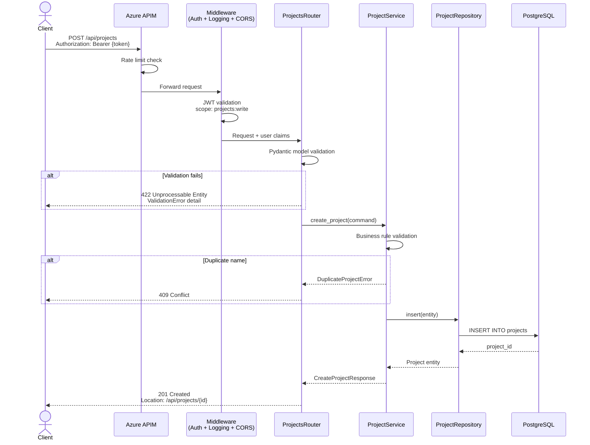
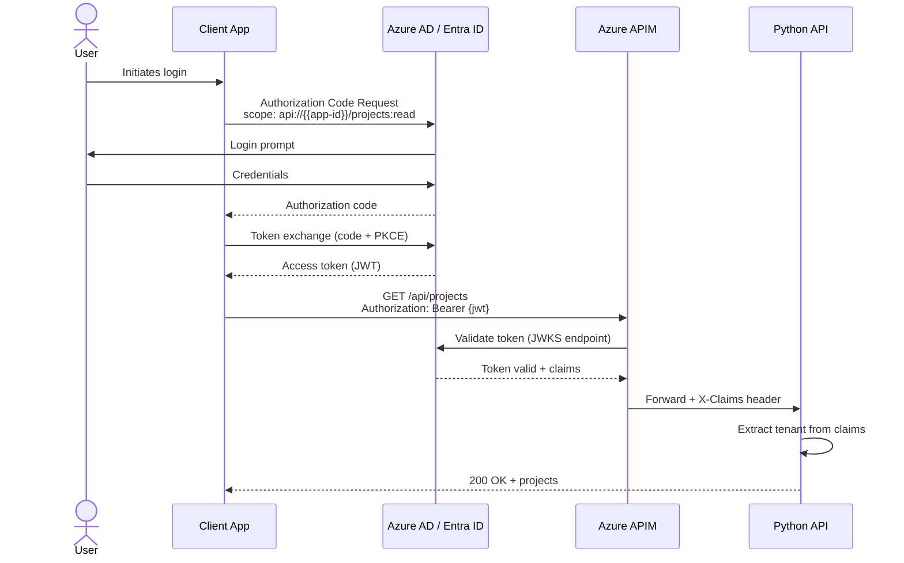
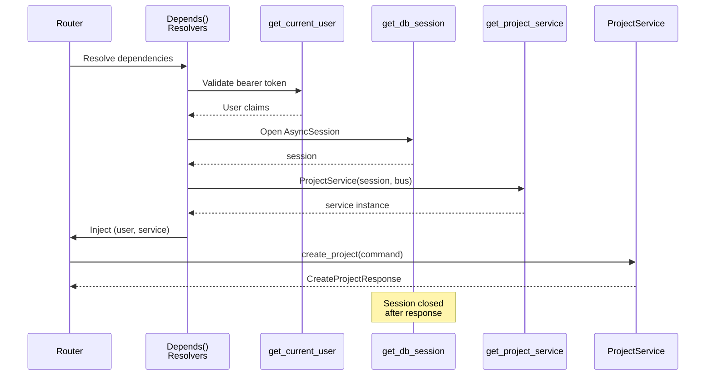
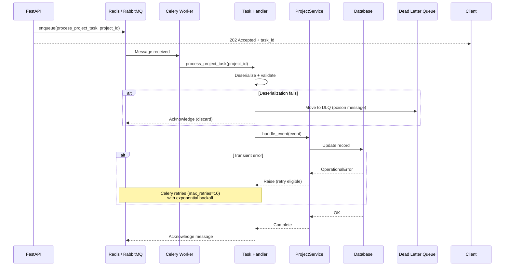
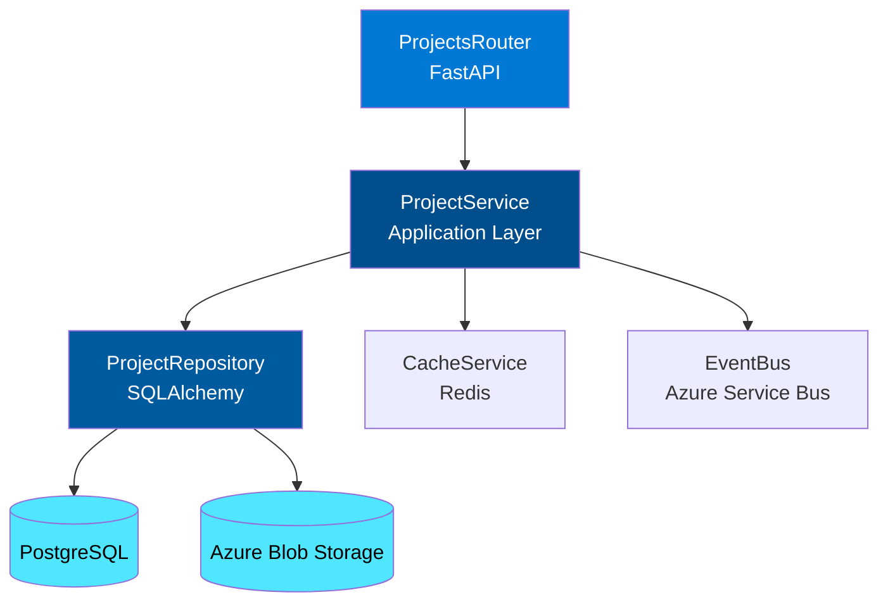
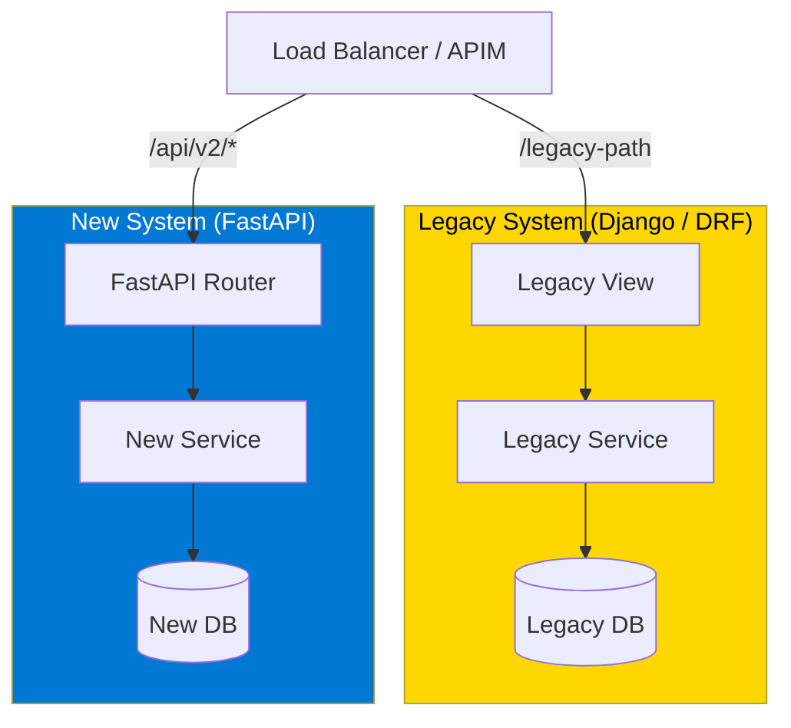
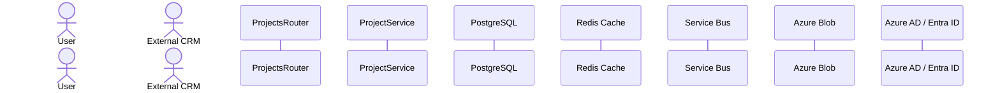
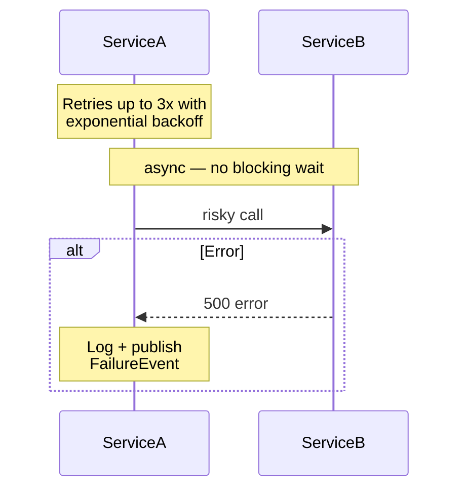

# Diagram Patterns for Python API Documentation

## Diagram Type Decision Guide

```
What are you documenting?
│
├── HTTP request lifecycle (middleware → router → service → DB)
│   └── sequenceDiagram
│
├── Auth flow (JWT validation, OAuth2, Entra ID)
│   └── sequenceDiagram
│
├── Service dependency graph (what depends on what)
│   └── graph TD (top-down)
│
├── Decision/routing logic (branching behavior)
│   └── flowchart TD
│
├── Event-driven / message bus / Celery task flows
│   └── sequenceDiagram
│
└── Simple overview for README (minimal tooling)
    └── ASCII box diagram
```

---

## Pattern 1: Standard HTTP Request Lifecycle

Use this for any router endpoint — customize participants for your actual stack.



---

## Pattern 2: JWT / Entra ID Authentication Flow



---

## Pattern 3: FastAPI Dependency Injection Flow



---

## Pattern 4: Celery / Background Task Flow



---

## Pattern 5: Service Dependency Graph

Use `graph TD` for showing architecture layers and dependencies.



---

## Pattern 6: Strangler Fig Migration (for modernization projects)



---

## Pattern 7: ASCII Box Diagram (no Mermaid renderer)

Use when the target platform may not render Mermaid (plain GitHub wikis, Confluence basic mode, etc.).

```
┌─────────────────────────────────────────────────────────┐
│                     Client (React SPA)                  │
└────────────────────────┬────────────────────────────────┘
                         │ HTTPS + Bearer JWT
                         ▼
┌─────────────────────────────────────────────────────────┐
│                    Azure APIM                           │
│          (Rate limiting, auth validation)               │
└────────────────────────┬────────────────────────────────┘
                         │
            ┌────────────┴────────────┐
            ▼                         ▼
┌───────────────────┐     ┌────────────────────────────┐
│  Projects API     │     │  Documents API             │
│  (FastAPI)        │     │  (FastAPI)                 │
└─────────┬─────────┘     └─────────────┬──────────────┘
          │                             │
          ▼                             ▼
┌───────────────────┐     ┌────────────────────────────┐
│   PostgreSQL      │     │   Azure Blob Storage       │
│   (Projects DB)   │     │   (Document Store)         │
└───────────────────┘     └────────────────────────────┘
```

---

## Mermaid Naming and Styling Conventions

### Participant naming



### Notes and annotations


### Arrow types

| Arrow | Meaning | When to use |
| ---- | ---- | ---- |
| `->>` | Solid arrow | Synchronous call / request |
| `-->>` | Dashed arrow | Response / async return |
| `-x` | Solid with X | Fire-and-forget / no response |
| `-->` | Open dashed | Return value (non-critical) |

### Color coding in graph diagrams (Azure palette)
```
Azure Blue (primary):     fill:#0078d4,color:#fff
Dark Azure:               fill:#004e8c,color:#fff
Azure Cyan (data):        fill:#50e6ff,color:#000
Legacy / Warning:         fill:#ffd700,color:#000
Error / Deprecated:       fill:#d13438,color:#fff
Success / New:            fill:#107c10,color:#fff
```

---

## Diagram Quality Checklist

Before including a diagram in documentation:

- [ ] All participant names match actual class/module names in the codebase
- [ ] Happy path is shown completely end-to-end
- [ ] At least one error/failure path is shown
- [ ] Auth/token flow is visible (don't hide it "behind" the API box)
- [ ] No placeholder text (`{{}}`) left in participant labels
- [ ] Mermaid syntax validated (no unclosed brackets, correct arrow syntax)
- [ ] Diagram is scoped — one flow per diagram, not everything at once
- [ ] Notes used sparingly — only for non-obvious behavior
