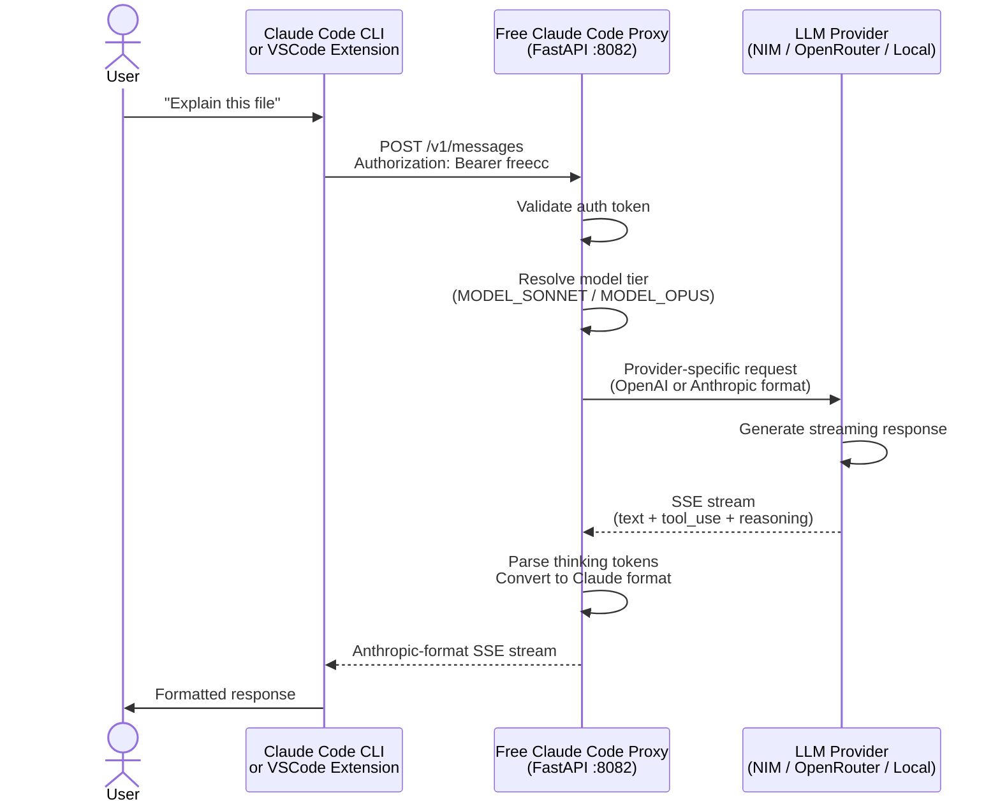
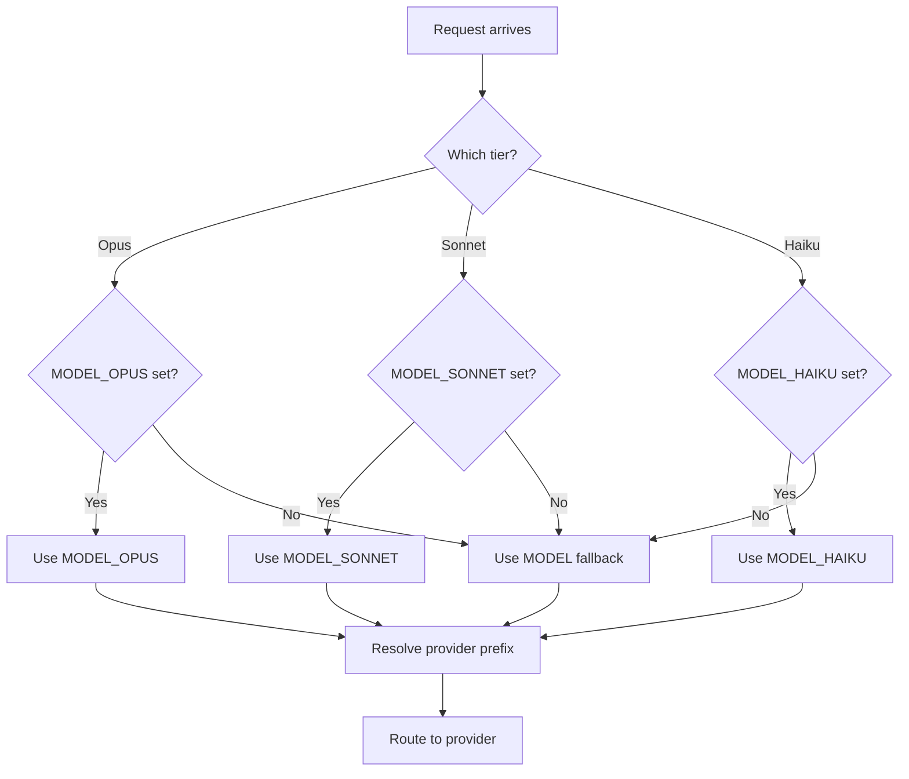

# Environment Setup Guide

> Configure your Free Claude Code proxy for local development and production use.


---

## Overview

This guide covers environment configuration for the Free Claude Code proxy. It explains how to set up your `.env` file, choose appropriate models for each Claude tier, and configure authentication tokens.

**Key capabilities:**

- **Per-model routing** — Route Opus/Sonnet/Haiku to different backends independently
- **Multi-provider support** — Mix NVIDIA NIM, OpenRouter, DeepSeek, and local providers
- **Thinking token support** — Parse `<think>` tags and `reasoning_content` into native Claude thinking blocks

---

## Quick Start

### Step 1: Create environment file

```bash
# From the project root
cp .env.nvidia.example .env
```

### Step 2: Generate auth token

```bash
openssl rand -base64 32
```

Paste the output as the value of `ANTHROPIC_AUTH_TOKEN` in `.env`.

### Step 3: Configure your provider

Edit `.env` with your API keys and model choices. See [Choosing Models](#choosing-models) for recommendations.

### Step 4: Start the server

```bash
uv run uvicorn server:app --host 0.0.0.0 --port 8082
```

---

## Architecture

### Request Flow



### Model Tier Resolution



---

## Configuration

### Core Variables

| Variable | Description | Required | Default |
| -------- | ----------- | -------- | ------- |
| `MODEL` | Fallback model for unrecognized tiers | Yes | `"nvidia_nim/z-ai/glm4.7"` |
| `MODEL_OPUS` | Model for Claude Opus requests | No | `""` |
| `MODEL_SONNET` | Model for Claude Sonnet requests | No | `""` |
| `MODEL_HAIKU` | Model for Claude Haiku requests | No | `""` |
| `ENABLE_MODEL_THINKING` | Enable thinking token parsing | No | `true` |
| `ENABLE_SONNET_THINKING` | Override thinking for Sonnet tier | No | inherits |
| `ENABLE_OPUS_THINKING` | Override thinking for Opus tier | No | inherits |
| `ENABLE_HAIKU_THINKING` | Override thinking for Haiku tier | No | inherits |

### Provider API Keys

| Variable | Provider | Required For |
| -------- | -------- | ------------ |
| `NVIDIA_NIM_API_KEY` | NVIDIA NIM | `nvidia_nim/*` models |
| `OPENROUTER_API_KEY` | OpenRouter | `open_router/*` models |
| `DEEPSEEK_API_KEY` | DeepSeek | `deepseek/*` models |

### Local Provider URLs

| Variable | Default | Provider |
| -------- | ------- | -------- |
| `LM_STUDIO_BASE_URL` | `http://localhost:1234/v1` | LM Studio |
| `LLAMACPP_BASE_URL` | `http://localhost:8080/v1` | llama.cpp |
| `OLLAMA_BASE_URL` | `http://localhost:11434` | Ollama |

---

## Choosing Models

Claude Code sends requests using three model tiers. The proxy maps each tier to a backend model via environment variables.

| Variable | Claude Tier | Role |
| -------- | ----------- | ---- |
| `MODEL_SONNET` | Sonnet | Most requests — editing, tool calls, reasoning |
| `MODEL_OPUS` | Opus | Complex multi-step tasks and reasoning |
| `MODEL_HAIKU` | Haiku | Fast/cheap tasks and simple queries |
| `MODEL` | Fallback | Any unrecognized model name |

> **Note:** Sonnet gets the most traffic, so model quality here matters most.

### Recommended NVIDIA NIM Models

| Model | `.env` Value | Notes |
| ----- | ------------ | ----- |
| Qwen 3.5 397B | `nvidia_nim/qwen/qwen3.5-397b-a17b` | Best for Sonnet — large MoE, strong tool calling |
| Qwen 3.5 122B | `nvidia_nim/qwen/qwen3.5-122b-a10b` | Lighter alternative if rate limits are a concern |
| Kimi K2 Thinking | `nvidia_nim/moonshotai/kimi-k2-thinking` | Good for Opus — reasoning model |
| Kimi K2.5 | `nvidia_nim/moonshotai/kimi-k2.5` | Solid all-rounder for Sonnet or Opus |
| GLM5 | `nvidia_nim/z-ai/glm5` | Lightweight fallback for Haiku |

> **Avoid `mistralai/devstral-2-123b-instruct-2512` for the Sonnet slot.** Devstral produces malformed tool call JSON, causing "The model's tool call could not be parsed" errors.

### Recommended Configuration

```dotenv
# Sonnet slot — optimized for tool calling and low latency
MODEL_SONNET="nvidia_nim/qwen/qwen3.5-397b-a17b"
ENABLE_SONNET_THINKING=false

# Opus slot — reasoning-heavy tasks
MODEL_OPUS="nvidia_nim/moonshotai/kimi-k2-thinking"
ENABLE_OPUS_THINKING=true

# Haiku slot — simple queries
MODEL_HAIKU="nvidia_nim/z-ai/glm5"

# Fallback for unrecognized tiers
MODEL="nvidia_nim/z-ai/glm5"
```

> **Why `ENABLE_SONNET_THINKING=false`?** The Sonnet slot handles high-frequency tool calls where latency matters. Leave thinking disabled for faster responses.

---

## Authentication

### Proxy Authentication

Set `ANTHROPIC_AUTH_TOKEN` to require clients to authenticate:

```dotenv
ANTHROPIC_AUTH_TOKEN="your-secret-token-here"
```

| Configuration | Behavior |
| ------------- | -------- |
| Empty or missing | No authentication required |
| Set to any value | Clients must provide matching token |

**Example usage:**

```bash
# With authentication
ANTHROPIC_AUTH_TOKEN="freecc" ANTHROPIC_BASE_URL="http://localhost:8082" claude

# claude-pick automatically uses the token from .env
claude-pick
```

---

## Error Handling

| Error Class | Status | Description |
| ----------- | ------ | ----------- |
| `missing_env` | Skip | Required credential or configuration not found |
| `upstream_unavailable` | Skip | LLM provider API unreachable |
| `product_failure` | Failure | App crashed or returned wrong shape |
| `harness_bug` | Failure | Test harness made invalid assumption |

---

## Troubleshooting

### Model fails to load

1. Check that the model name in `.env` matches the provider format
2. Verify API key is valid: `curl -H "Authorization: Bearer $NVIDIA_NIM_API_KEY" https://integrate.api.nvidia.com/v1/models`
3. Ensure provider is accessible from your network

### Thinking tokens not appearing

1. Verify `ENABLE_MODEL_THINKING=true` (or tier-specific override)
2. Confirm the model supports reasoning output
3. Check server logs for parsing errors

### Rate limit errors

1. Reduce request frequency or increase `PROVIDER_RATE_WINDOW`
2. Set `PROVIDER_MAX_CONCURRENCY` to limit simultaneous requests
3. Consider upgrading API tier or switching providers

---

## Related

- [start/README.md](start/README.md) — Production workflow setup
- [README.md](README.md) — Main project documentation
- [.env.example](.env.example) — Template environment file
