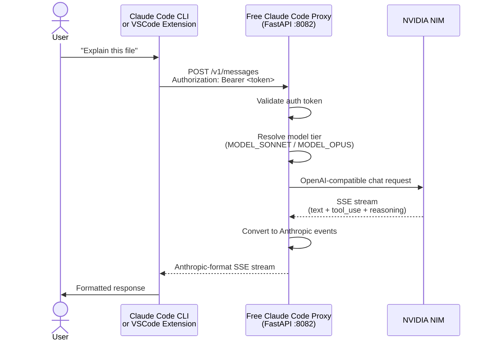
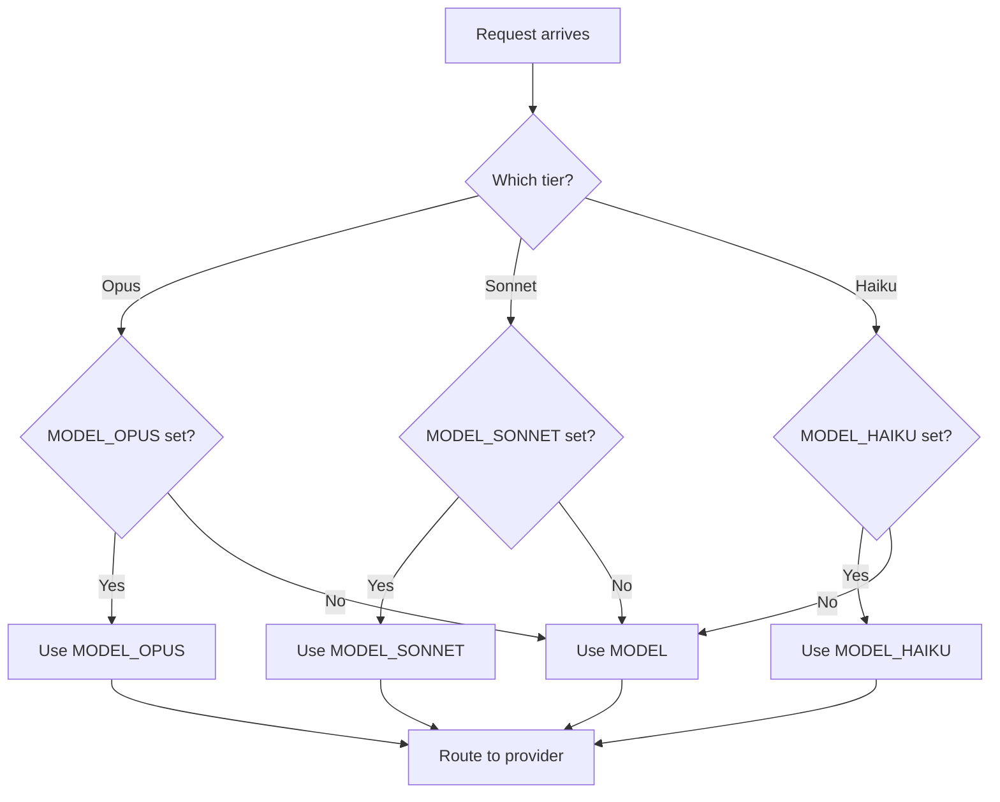

# NVIDIA NIM Setup Guide

> Configure the Echelix fork of Free Claude Code against NVIDIA NIM. For other providers
> see [Choose A Provider](README.md#choose-a-provider) in the root README.


---

## Overview

Free Claude Code (FCC) is a local proxy that lets Claude Code talk to NVIDIA NIM models.
This guide covers the Echelix workflow: one managed config file, a background proxy, and a
`claudex` launcher.

**Key facts:**

- **Config lives in `~/.fcc/.env`.** FCC manages it; the Admin UI edits it. A repo-local
  `.env` is imported into it once on first start and then ignored.
- **Per-tier routing.** Route Opus / Sonnet / Haiku to different NIM models independently.
- **Deprecated models self-heal.** Retired NIM refs listed in
  `src/free_claude_code/config/model_refs.py` are rewritten to their replacement on start.
- **Native model picker.** Inside Claude Code, `/model` lists every NIM model the proxy
  exposes, so no separate picker script is needed.

---

## Quick Start

### Step 1: Install dependencies

```bash
git clone https://github.com/Echelix/free-claude-code.git
cd free-claude-code
./start/setup-env.sh          # installs uv + Python 3.14, runs uv sync, offers shell aliases
```

Windows PowerShell: `.\start\setup-env.ps1`.

### Step 2: Create the managed config

```bash
mkdir -p ~/.fcc
cp .env.nvidia.example ~/.fcc/.env
```

### Step 3: Generate the auth token

```bash
openssl rand -base64 32
```

Paste the output as `ANTHROPIC_AUTH_TOKEN` in `~/.fcc/.env` and keep
`PROXY_AUTH_ENABLED=true`. Nothing else needs the token: `claudex` and `fcc-claude` read
it from the managed config before launching Claude Code.

### Step 4: Configure the provider

Set `NVIDIA_NIM_API_KEY` and adjust `MODEL_*` in `~/.fcc/.env`. See
[Choosing Models](#choosing-models). Alternatively start the proxy and use the Admin UI
at `http://localhost:8082/admin`.

### Step 5: Start the proxy

```bash
fcc-start          # detached background server, returns immediately
fcc-status         # confirm it is running
```

The proxy listens on `http://localhost:8082`. Logs go to `~/.fcc/logs/server.log`.

### Step 6: Launch Claude Code

```bash
claudex            # equivalent to fcc-claude: waits for the proxy, sets env, runs claude
```

Stop the proxy when done:

```bash
fcc-stop
```

---

## Architecture

### Request Flow



### Model Tier Resolution



---

## Configuration

> Defaults below reflect `.env.nvidia.example`. Every key is also editable in the Admin UI.

### Core Variables

| Variable | Description | Default |
| -------- | ----------- | ------- |
| `MODEL` | Fallback model for unrecognised tiers | `nvidia_nim/qwen/qwen3-next-80b-a3b-thinking` |
| `MODEL_OPUS` | Model for Claude Opus requests | `nvidia_nim/qwen/qwen3-next-80b-a3b-thinking` |
| `MODEL_SONNET` | Model for Claude Sonnet requests | `nvidia_nim/qwen/qwen3.5-397b-a17b` |
| `MODEL_HAIKU` | Model for Claude Haiku requests | `nvidia_nim/qwen/qwen3.5-122b-a10b` |
| `MODEL_FALLBACKS` | Ordered fallbacks tried when a provider fails before output | unset |
| `REASONING_POLICY` | Root reasoning policy: `off`, `client`, `low` … `max` | `client` |
| `REASONING_OPUS` / `REASONING_SONNET` / `REASONING_HAIKU` | Per-tier override, or `inherit` | `inherit` / `off` / `off` |

The legacy `ENABLE_*_THINKING` keys are migrated to `REASONING_*` automatically.

### Provider API Keys

| Variable | Provider | Required For |
| -------- | -------- | ------------ |
| `NVIDIA_NIM_API_KEY` | NVIDIA NIM | `nvidia_nim/*` models |
| `OPENROUTER_API_KEY` | OpenRouter | `open_router/*` models |

### Proxy Authentication

| Variable | Description | Default |
| -------- | ----------- | ------- |
| `PROXY_AUTH_ENABLED` | Enforce the bearer token on every request | `true` |
| `ANTHROPIC_AUTH_TOKEN` | Token clients must send | generate one |
| `HOST` / `PORT` | Bind address and port | `0.0.0.0` / `8082` |

### Rate Limiting

| Variable | Description | Default |
| -------- | ----------- | ------- |
| `PROVIDER_RATE_LIMIT` | Max requests per rate window | `40` |
| `PROVIDER_RATE_WINDOW` | Window length in seconds | `60` |
| `PROVIDER_MAX_CONCURRENCY` | Max in-flight provider requests | `5` |

### HTTP Timeouts (seconds)

| Variable | Description | Default |
| -------- | ----------- | ------- |
| `HTTP_READ_TIMEOUT` | Wait for a response chunk | `180` |
| `HTTP_WRITE_TIMEOUT` | Wait when writing the request | `10` |
| `HTTP_CONNECT_TIMEOUT` | Wait for a TCP connection | `2` |

### Logging

| Variable | Description | Default |
| -------- | ----------- | ------- |
| `LOG_LEVEL` | File sink level (`DEBUG` … `CRITICAL`) | `INFO` |
| `TRUNCATE_LOG_ON_START` | Echelix: clear `~/.fcc/logs/server.log` on each start; `false` keeps an audit trail | `true` |
| `LOG_API_ERROR_TRACEBACKS` | Include tracebacks in API error entries | `true` |
| `LOG_RAW_API_PAYLOADS` | Log request/response bodies (sensitive) | `false` |

### Background workflow

| Variable | Description | Default |
| -------- | ----------- | ------- |
| `FCC_OPEN_BROWSER` | Open the Admin UI in a browser when the server becomes healthy | `false` |
| `MESSAGING_PLATFORM` | `telegram`, `discord`, or `none` | `none` |

---

## Choosing Models

Claude Code sends requests using three model tiers.

| Variable | Claude Tier | Role |
| -------- | ----------- | ---- |
| `MODEL_SONNET` | Sonnet | Most requests: editing, tool calls |
| `MODEL_OPUS` | Opus | Complex multi-step reasoning |
| `MODEL_HAIKU` | Haiku | Fast, cheap tasks |
| `MODEL` | Fallback | Any unrecognised model name |

### Recommended NVIDIA NIM Models

| Model | Value | Notes |
| ----- | ----- | ----- |
| Qwen 3.5 397B | `nvidia_nim/qwen/qwen3.5-397b-a17b` | Best for Sonnet: large MoE, strong tool calling |
| Qwen3 Next 80B Thinking | `nvidia_nim/qwen/qwen3-next-80b-a3b-thinking` | Best for Opus: reasoning model |
| Qwen 3.5 122B | `nvidia_nim/qwen/qwen3.5-122b-a10b` | Haiku: fast, non-thinking |
| Nemotron 3 Super 120B | `nvidia_nim/nvidia/nemotron-3-super-120b-a12b` | Upstream default; solid general fallback |

> Avoid `mistralai/devstral-2-123b-instruct-2512` for the Sonnet slot: it emits malformed
> tool-call JSON.

To browse the live catalogue, start the proxy and run `/model` inside Claude Code, or:

```bash
curl -H "Authorization: Bearer $NVIDIA_NIM_API_KEY" https://integrate.api.nvidia.com/v1/models
```

### Deprecated models

When NIM retires a model, add it to `DEPRECATED_NVIDIA_NIM_MODELS` in
`src/free_claude_code/config/model_refs.py`. On the next start FCC rewrites the old ref in
`~/.fcc/.env` to the replacement and logs the repair. Current entries map the retired Kimi
K2 models to their Qwen replacements.

---

## Troubleshooting

### Proxy will not start

1. `fcc-status` says not running: check `~/.fcc/logs/server.log`.
2. Port in use: another FCC instance is running; `fcc-stop` or change `PORT`.
3. Validation errors name the offending key in `~/.fcc/.env`.

### Model fails to load

1. Check the model ref format: `nvidia_nim/<org>/<model>`.
2. Verify the API key with the curl command above.
3. Look for a "Repaired retired provider selections" line in the log: the ref was deprecated.

### Thinking tokens not appearing

1. Verify `REASONING_POLICY=client` and the tier override is not `off`.
2. Confirm the model supports reasoning output.

### Rate limit errors

1. Lower `PROVIDER_RATE_LIMIT` or `PROVIDER_MAX_CONCURRENCY`.
2. Consider a lighter model for the Haiku tier.

---

## Related

- [start/README.md](start/README.md): background proxy workflow
- [README.md](README.md): main project documentation
- [docs/SECURITY.md](docs/SECURITY.md): security audit and hardening
