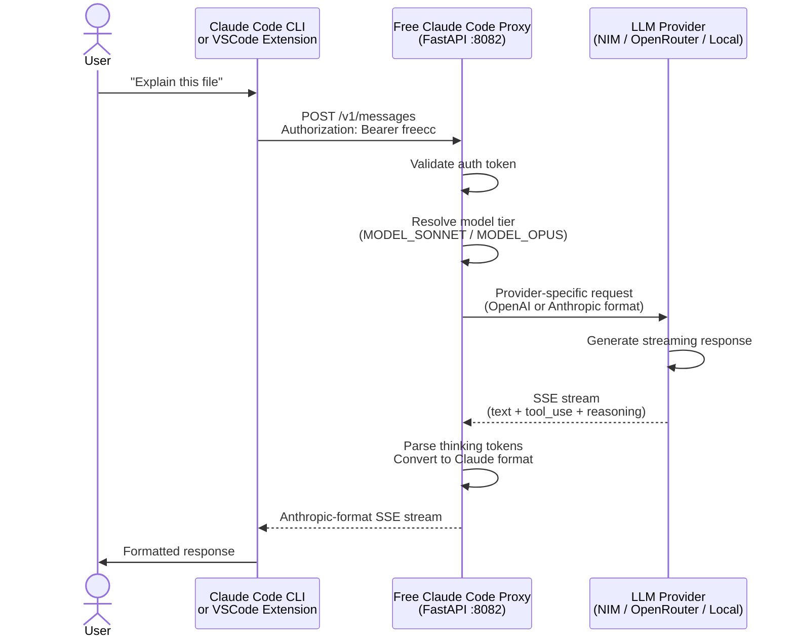
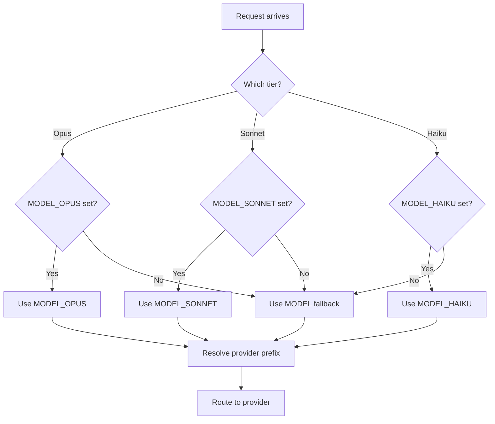

# NVIDIA NIM Setup Guide

> Configure your Free Claude Code proxy against NVIDIA NIM. For OpenRouter, DeepSeek, LM Studio, llama.cpp, and Ollama, see the provider walk-throughs in the root [README.md](README.md).


---

## Overview

This guide covers NVIDIA NIM environment configuration for the Free Claude Code proxy. It explains how to set up your `.env` file from `.env.nvidia.example`, choose appropriate NIM models for each Claude tier, and configure authentication tokens.

**Key capabilities:**

- **Per-model routing** — Route Opus/Sonnet/Haiku to different backends independently
- **Multi-provider support** — Mix NVIDIA NIM, OpenRouter, DeepSeek, and local providers
- **Thinking token support** — Parse `<think>` tags and `reasoning_content` into native Claude thinking blocks

---

## Quick Start

The recommended workflow uses `fcc-start` (background proxy) and `claudex` (Claude Code launcher) from the [`start/` workflow](start/README.md). The proxy reads its configuration from `.env`; `start/run.sh` and `start/run.ps1` read the auth token from `.env` so there is a single source of truth.

### Step 1: Create environment file

```bash
# From the project root
cp .env.nvidia.example .env
```

### Step 2: Generate the auth token

```bash
openssl rand -base64 32
```

Paste the output as the value of `ANTHROPIC_AUTH_TOKEN` in `.env`. **Do not** hardcode the token anywhere else — `start/run.sh` and `start/run.ps1` read it from `.env` at launch.

### Step 3: Configure your provider

Edit `.env` with your `NVIDIA_NIM_API_KEY` and any model overrides. See [Choosing Models](#choosing-models) for recommendations.

### Step 4: Set up shell aliases

Follow [`start/README.md`](start/README.md) to add the `fcc-start`, `fcc-stop`, `fcc-status`, and `claudex` aliases to your shell profile (zsh / bash / PowerShell).

### Step 5: Start the proxy

```bash
fcc-start          # background, returns immediately
fcc-status         # confirm it's running
```

The proxy listens on `http://localhost:8082` and validates configured models against the NIM catalog at startup — it will refuse to start if any `MODEL_*` references a model that NIM does not currently expose.

### Step 6: Launch Claude Code

```bash
claudex            # reads .env, sets ANTHROPIC_BASE_URL + ANTHROPIC_AUTH_TOKEN, runs claude
```

To stop the background proxy:

```bash
fcc-stop
```

> **Why not `uv run uvicorn server:app …`?** That works, but you'd need to forward `ANTHROPIC_AUTH_TOKEN` and `ANTHROPIC_BASE_URL` to every Claude invocation manually. `fcc-start` + `claudex` does that for you and survives across multiple Claude sessions.

---

## Architecture

### Request Flow



### Model Tier Resolution



---

## Configuration

> Defaults below reflect `.env.nvidia.example`. See the root [README.md](README.md) for non-NVIDIA provider configurations.

### Core Variables

| Variable | Description | Required | Default |
| -------- | ----------- | -------- | ------- |
| `MODEL` | Fallback model for unrecognized tiers | Yes | `"nvidia_nim/qwen/qwen3-next-80b-a3b-thinking"` |
| `MODEL_OPUS` | Model for Claude Opus requests | No | `"nvidia_nim/qwen/qwen3-next-80b-a3b-thinking"` |
| `MODEL_SONNET` | Model for Claude Sonnet requests | No | `"nvidia_nim/qwen/qwen3.5-397b-a17b"` |
| `MODEL_HAIKU` | Model for Claude Haiku requests | No | `"nvidia_nim/qwen/qwen3.5-122b-a10b"` |
| `ENABLE_MODEL_THINKING` | Enable thinking token parsing | No | `true` |
| `ENABLE_SONNET_THINKING` | Override thinking for Sonnet tier | No | `false` |
| `ENABLE_OPUS_THINKING` | Override thinking for Opus tier | No | inherits |
| `ENABLE_HAIKU_THINKING` | Override thinking for Haiku tier | No | inherits |

### Provider API Keys

| Variable | Provider | Required For |
| -------- | -------- | ------------ |
| `NVIDIA_NIM_API_KEY` | NVIDIA NIM | `nvidia_nim/*` models |
| `OPENROUTER_API_KEY` | OpenRouter | `open_router/*` models |
| `DEEPSEEK_API_KEY` | DeepSeek | `deepseek/*` models |

### Local Provider URLs

| Variable | Default | Provider |
| -------- | ------- | -------- |
| `LM_STUDIO_BASE_URL` | `http://localhost:1234/v1` | LM Studio |
| `LLAMACPP_BASE_URL` | `http://localhost:8080/v1` | llama.cpp |
| `OLLAMA_BASE_URL` | `http://localhost:11434` | Ollama |

### Rate Limiting

| Variable | Description | Default |
| -------- | ----------- | ------- |
| `PROVIDER_RATE_LIMIT` | Max requests allowed per rate window | `40` |
| `PROVIDER_RATE_WINDOW` | Rate window duration in seconds | `60` |
| `PROVIDER_MAX_CONCURRENCY` | Max simultaneous in-flight requests to the provider | `5` |

### HTTP Timeouts (seconds)

| Variable | Description | Default |
| -------- | ----------- | ------- |
| `HTTP_READ_TIMEOUT` | Time to wait for a response chunk from the provider | `180` |
| `HTTP_WRITE_TIMEOUT` | Time to wait when writing the upstream request | `10` |
| `HTTP_CONNECT_TIMEOUT` | Time to wait for a TCP connection to the provider | `2` |

### Logging

| Variable | Description | Default |
| -------- | ----------- | ------- |
| `TRUNCATE_LOG_ON_START` | Clear `server.log` each time the proxy starts | `true` |
| `LOG_API_ERROR_TRACEBACKS` | Include full tracebacks in API error log entries | `true` |
| `LOG_RAW_API_PAYLOADS` | Log full request/response bodies (may contain sensitive data) | `false` |
| `LOG_RAW_SSE_EVENTS` | Log every SSE event from the provider stream | `false` |

### Messaging (disabled by default)

| Variable | Description | Default |
| -------- | ----------- | ------- |
| `MESSAGING_PLATFORM` | Bot platform: `"telegram"`, `"discord"`, or `"none"` | `"none"` |
| `MESSAGING_RATE_LIMIT` | Max outbound messages per rate window | `1` |

---

## Choosing Models

Claude Code sends requests using three model tiers. The proxy maps each tier to a backend model via environment variables.

| Variable | Claude Tier | Role |
| -------- | ----------- | ---- |
| `MODEL_SONNET` | Sonnet | Most requests — editing, tool calls, reasoning |
| `MODEL_OPUS` | Opus | Complex multi-step tasks and reasoning |
| `MODEL_HAIKU` | Haiku | Fast/cheap tasks and simple queries |
| `MODEL` | Fallback | Any unrecognized model name |

> **Note:** Sonnet gets the most traffic, so model quality here matters most.

### Recommended NVIDIA NIM Models

| Model | `.env` Value | Notes |
| ----- | ------------ | ----- |
| Qwen 3.5 397B | `nvidia_nim/qwen/qwen3.5-397b-a17b` | Best for Sonnet — large MoE, strong tool calling |
| Qwen 3.5 122B | `nvidia_nim/qwen/qwen3.5-122b-a10b` | Lighter alternative if rate limits are a concern |
| Qwen3 Next 80B Thinking | `nvidia_nim/qwen/qwen3-next-80b-a3b-thinking` | Best for Opus — reasoning model |
| Qwen 3.5 122B | `nvidia_nim/qwen/qwen3.5-122b-a10b` | Recommended for Haiku — non-thinking, fast |
| GLM5 | `nvidia_nim/z-ai/glm5` | Lightweight fallback for Haiku |

> **Avoid `mistralai/devstral-2-123b-instruct-2512` for the Sonnet slot.** Devstral produces malformed tool call JSON, causing "The model's tool call could not be parsed" errors.

### Recommended Configuration

```dotenv
# Sonnet slot — optimized for tool calling and low latency
MODEL_SONNET="nvidia_nim/qwen/qwen3.5-397b-a17b"
ENABLE_SONNET_THINKING=false

# Opus slot — reasoning-heavy tasks
MODEL_OPUS="nvidia_nim/qwen/qwen3-next-80b-a3b-thinking"
ENABLE_OPUS_THINKING=true

# Haiku slot — simple queries
MODEL_HAIKU="nvidia_nim/z-ai/glm5"

# Fallback for unrecognized tiers
MODEL="nvidia_nim/z-ai/glm5"
```

> **Why `ENABLE_SONNET_THINKING=false`?** The Sonnet slot handles high-frequency tool calls where latency matters. Leave thinking disabled for faster responses.

---

## Authentication

### Proxy Authentication

`ANTHROPIC_AUTH_TOKEN` is **required**. The proxy listens on `0.0.0.0:8082` by default, so without a token any process on your machine — or your local network — can reach it, impersonate a client, and consume your upstream API quota.

### Single source of truth

The token lives in `.env` only. Every consumer reads it from there:

| Consumer | How it reads the token |
| -------- | ---------------------- |
| The proxy server (`fcc-start` / `uvicorn server:app`) | Loaded by Pydantic settings from `.env` |
| `claudex` | Reads `.env` and exports `ANTHROPIC_AUTH_TOKEN` before launching `claude` |
| `claude-pick` | Reads `.env` and exports the token (also supports `freecc:provider/model` suffix syntax) |
| `start/run.sh` / `start/run.ps1` | Sources `.env` and exports `ANTHROPIC_AUTH_TOKEN` before launching `claude` |

> **Do not** copy the token literal into `start/run.sh`, `start/run.ps1`, shell aliases, or any tracked file. The shipped scripts read from `.env` precisely so the token never lands in git history.

### Generate

```bash
openssl rand -base64 32
```

```dotenv
# .env
ANTHROPIC_AUTH_TOKEN="paste-generated-token-here"
```

| Configuration | Behavior |
| ------------- | -------- |
| Empty or missing | **No authentication — proxy is open to anyone who can reach the port** |
| Set to any value | All clients must provide a matching `Authorization: Bearer <token>` header |

### Use

```bash
# Start the proxy in the background, then launch Claude:
fcc-start
claudex

# Or use the model picker:
claude-pick

# Or run the bundled Bash launcher (delegates to claude after sourcing .env):
./start/run.sh
```

---

## Error Handling

| Error Class | Status | Description |
| ----------- | ------ | ----------- |
| `missing_env` | Skip | Required credential or configuration not found |
| `upstream_unavailable` | Skip | LLM provider API unreachable |
| `product_failure` | Failure | App crashed or returned wrong shape |
| `harness_bug` | Failure | Test harness made invalid assumption |

---

## Troubleshooting

### Model fails to load

1. Check that the model name in `.env` matches the provider format
2. Verify API key is valid: `curl -H "Authorization: Bearer $NVIDIA_NIM_API_KEY" https://integrate.api.nvidia.com/v1/models`
3. Ensure provider is accessible from your network

### Thinking tokens not appearing

1. Verify `ENABLE_MODEL_THINKING=true` (or tier-specific override)
2. Confirm the model supports reasoning output
3. Check server logs for parsing errors

### Rate limit errors

1. Reduce request frequency or increase `PROVIDER_RATE_WINDOW`
2. Set `PROVIDER_MAX_CONCURRENCY` to limit simultaneous requests
3. Consider upgrading API tier or switching providers

---

## Related

- [start/README.md](start/README.md) — Production workflow setup
- [README.md](README.md) — Main project documentation
- [.env.example](.env.example) — Template environment file
