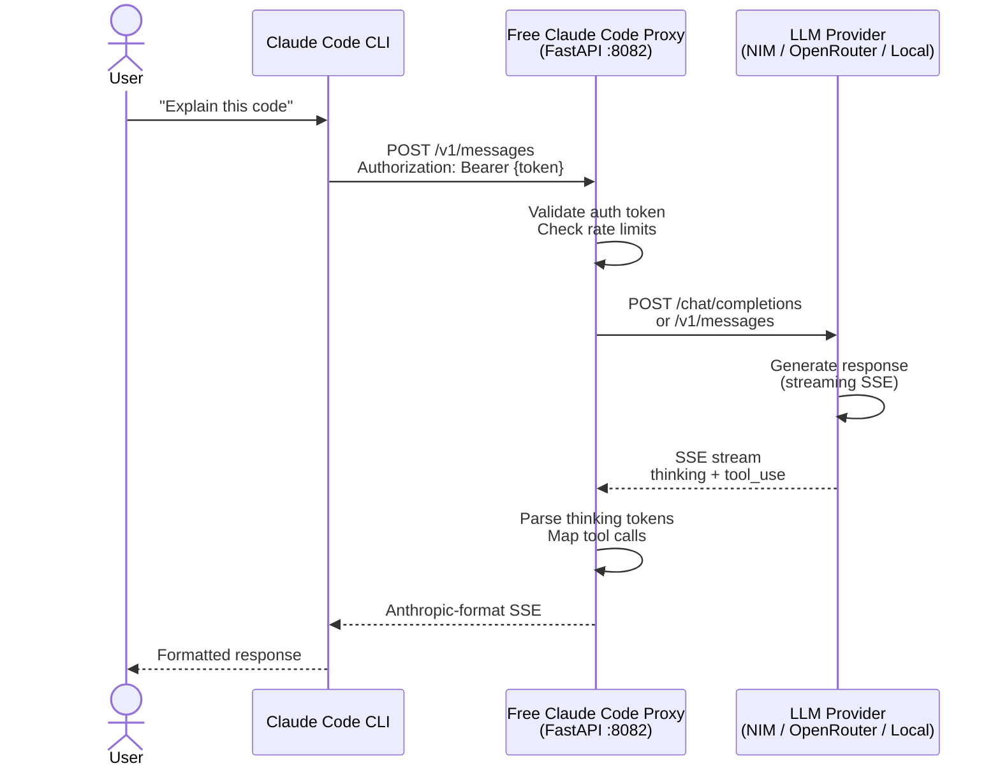

# start — Production Workflow for Free Claude Code

> Daily-use workflow with fixed model configuration for NVIDIA NIM and OpenAI-compatible APIs.


<!--  -->

---

## Overview

The `start` workflow provides a production-ready setup for running Claude Code CLI with locally-hosted or proxied LLM backends. Unlike the interactive `claude-pick` workflow, `start` is designed for daily use where you configure your model once and launch Claude CLI immediately without prompts.

**Key capabilities:**

- **Headless operation** — No interactive prompts; suitable for CI/CD and scripted environments
- **Background server management** — Proxy runs as a background service with `fcc-start` / `fcc-stop`
- **Session persistence** — Proxy survives across multiple `claudex` invocations
- **Multi-provider support** — NVIDIA NIM, OpenRouter, DeepSeek, LM Studio, llama.cpp, Ollama

### Workflow Comparison

| Workflow | Best For | Providers | Interactive? |
| -------- | -------- | --------- | ------------- |
| **start** (this workflow) | Daily development, production use | NVIDIA NIM, OpenAI-compatible APIs | No |
| **claude-pick** | Testing, model exploration | NVIDIA NIM, OpenRouter, LM Studio, llama.cpp | Yes |

---

## Prerequisites

| Requirement | Version |
| ----------- | ------- |
| Python | 3.14 |
| uv | Latest |
| fzf | Required for model picker (optional for start workflow) |

### Install Dependencies

```bash
# Install uv package manager
curl -LsSf https://astral.sh/uv/install.sh | sh

# Install Python 3.14
uv python install 3.14

# Install project dependencies
uv sync
```

---

## Getting Started

### 1. Clone and configure

```bash
git clone https://github.com/Alishahryar1/free-claude-code.git
cd free-claude-code
cp .env.example .env
```

### 2. Create virtual environment and install

```bash
uv venv
source .venv/bin/activate  # Windows: .venv\Scripts\activate
uv sync
```

### 3. Configure environment

Edit `.env` with your API keys. See [README_ENV.md](../README_ENV.md) for detailed configuration options.

```dotenv
# Generate a secure token first: openssl rand -base64 32
ANTHROPIC_AUTH_TOKEN="your-secure-token-here"   # required — see Security note below
NVIDIA_NIM_API_KEY="nvapi-your-key-here"
MODEL_SONNET="nvidia_nim/qwen/qwen3.5-397b-a17b"
```

> **Security:** `ANTHROPIC_AUTH_TOKEN` is required. Without it, any process on your machine can reach the proxy and consume your API quota. Generate a token with `openssl rand -base64 32` and paste it as the value.

### 4. Set up shell aliases

> **Important:** Replace the paths below with your actual repository location.

#### macOS (zsh/bash)

Add the following to `~/.zshrc` or `~/.bash_profile`:

```bash
alias fcc-start='/absolute/path/to/free-claude-code/.venv/bin/fcc-start'
alias fcc-stop='/absolute/path/to/free-claude-code/.venv/bin/fcc-stop'
alias fcc-status='/absolute/path/to/free-claude-code/.venv/bin/fcc-status'
alias claudex='/absolute/path/to/free-claude-code/.venv/bin/claudex'
```

Reload your shell:

```bash
source ~/.zshrc  # or source ~/.bash_profile
```

#### Windows (PowerShell)

Add to your PowerShell profile (`$PROFILE`):

```powershell
function fcc-start { & C:\path\to\free-claude-code\.venv\Scripts\fcc-start.ps1 }
function fcc-stop { & C:\path\to\free-claude-code\.venv\Scripts\fcc-stop.ps1 }
function fcc-status { & C:\path\to\free-claude-code\.venv\Scripts\fcc-status.ps1 }
function claudex { & C:\path\to\free-claude-code\.venv\Scripts\claudex.ps1 }
```

#### Windows (Command Prompt)

Create a batch file or add to startup:

```batch
@echo off
doskey fcc-start=C:\path\to\free-claude-code\.venv\Scripts\fcc-start.bat $*
doskey fcc-stop=C:\path\to\free-claude-code\.venv\Scripts\fcc-stop.bat $*
doskey fcc-status=C:\path\to\free-claude-code\.venv\Scripts\fcc-status.bat $*
doskey claudex=C:\path\to\free-claude-code\.venv\Scripts\claudex.bat $*
```

### 5. Run the workflow

```bash
# Start the proxy server in the background
fcc-start

# Check server status
fcc-status

# Launch Claude Code from any directory
claudex

# Stop the proxy when done
fcc-stop
```

---

## Workflow Commands

| Command | Description |
| ------- | ----------- |
| `fcc-start` | Start proxy server in background, returns immediately |
| `fcc-status` | Check if proxy server is running |
| `claudex` | Launch Claude Code CLI from any directory |
| `fcc-stop` | Stop the background proxy server |

---

## Architecture

### Request Flow



### Project Structure

```text
free-claude-code/
├── server.py           # FastAPI application entry point
├── api/
│   ├── app.py          # Application factory
│   ├── routes.py       # API router registration
│   └── services.py     # Provider service layer
├── core/
│   └── anthropic/      # Anthropic protocol helpers
├── providers/
│   ├── base.py         # BaseProvider ABC
│   ├── nvidia_nim.py   # NVIDIA NIM implementation
│   └── openai_compat.py # OpenAI-compatible providers
├── config/
│   └── settings.py     # Pydantic settings model
├── start/
│   ├── setup-env.sh    # Automated setup script
│   ├── server.sh       # Manual server launcher
│   └── README.md       # This file
└── tests/              # Test suite
```

---

## Configuration

### Environment Variables

See [README_ENV.md](../README_ENV.md) for the complete reference. All variables present in `.env.nvidia.example`:

#### Security

| Variable | Description | Required | Default |
| -------- | ----------- | -------- | ------- |
| `ANTHROPIC_AUTH_TOKEN` | Proxy auth token — prevents unauthorized local access to the proxy | **Required** | `""` |

> **Security note:** Always set `ANTHROPIC_AUTH_TOKEN`. The proxy listens on `0.0.0.0` so any process on your machine (or network) can reach it without this token. Generate a secure value with `openssl rand -base64 32`.

#### Provider API Keys

| Variable | Description | Required For |
| -------- | ----------- | ------------ |
| `NVIDIA_NIM_API_KEY` | NVIDIA NIM API key | `nvidia_nim/*` models |
| `OPENROUTER_API_KEY` | OpenRouter API key | `open_router/*` models |

#### Model Routing

| Variable | Description | Default |
| -------- | ----------- | ------- |
| `MODEL` | Fallback model used when no tier-specific override is set | `"nvidia_nim/z-ai/glm4.7"` |
| `MODEL_OPUS` | Model for Opus-tier requests | inherits `MODEL` |
| `MODEL_SONNET` | Model for Sonnet-tier requests | inherits `MODEL` |
| `MODEL_HAIKU` | Model for Haiku-tier requests | inherits `MODEL` |
| `ENABLE_MODEL_THINKING` | Enable thinking token parsing globally | `true` |
| `ENABLE_OPUS_THINKING` | Override thinking for Opus tier | inherits `ENABLE_MODEL_THINKING` |
| `ENABLE_SONNET_THINKING` | Override thinking for Sonnet tier | inherits `ENABLE_MODEL_THINKING` |
| `ENABLE_HAIKU_THINKING` | Override thinking for Haiku tier | inherits `ENABLE_MODEL_THINKING` |

#### Local Provider URLs

| Variable | Default | Provider |
| -------- | ------- | -------- |
| `LM_STUDIO_BASE_URL` | `http://localhost:1234/v1` | LM Studio |
| `LLAMACPP_BASE_URL` | `http://localhost:8080/v1` | llama.cpp |

#### Rate Limiting

| Variable | Description | Default |
| -------- | ----------- | ------- |
| `PROVIDER_RATE_LIMIT` | Max requests allowed per rate window | `40` |
| `PROVIDER_RATE_WINDOW` | Rate window duration in seconds | `60` |
| `PROVIDER_MAX_CONCURRENCY` | Max simultaneous in-flight requests to the provider | `5` |

#### HTTP Timeouts (seconds)

| Variable | Description | Default |
| -------- | ----------- | ------- |
| `HTTP_READ_TIMEOUT` | Time to wait for a response chunk from the provider | `120` |
| `HTTP_WRITE_TIMEOUT` | Time to wait when writing the upstream request | `10` |
| `HTTP_CONNECT_TIMEOUT` | Time to wait for a TCP connection to the provider | `2` |

#### Logging

| Variable | Description | Default |
| -------- | ----------- | ------- |
| `LOG_API_ERROR_TRACEBACKS` | Include full tracebacks in error log entries | `false` |
| `TRUNCATE_LOG_ON_START` | Clear `server.log` each time the proxy starts | `true` |

#### Messaging (disabled by default)

| Variable | Description | Default |
| -------- | ----------- | ------- |
| `MESSAGING_PLATFORM` | Bot platform: `"telegram"`, `"discord"`, or `"none"` | `"none"` |
| `MESSAGING_RATE_LIMIT` | Max outbound messages per rate window | `1` |

---

## Development

### Install development dependencies

```bash
uv sync --all-extras
```

### Run the server

```bash
uv run uvicorn server:app --host 0.0.0.0 --port 8082 --reload
```

### Run tests

```bash
# All tests
uv run pytest

# Product smoke tests (requires FCC_LIVE_SMOKE=1)
FCC_LIVE_SMOKE=1 uv run pytest smoke/product -n 0 -s --tb=short

# Unit tests only
uv run pytest tests/
```

### Lint and type check

```bash
# Format code
uv run ruff format .

# Lint
uv run ruff check .

# Type check
uv run ty check
```

### Code style

This project uses [Ruff](https://docs.astral.sh/ruff/) for linting and formatting, and [ty](https://ty.astral.sh/) for type checking. Run `ruff format . && ruff check .` before committing.

---

## Error Handling

| Error | Status | Description |
| ----- | ------ | ----------- |
| `missing_env` | Skip | Required environment variable not set |
| `upstream_unavailable` | Skip | LLM provider unreachable |
| `product_failure` | Failure | App returned wrong shape or crashed |
| `harness_bug` | Failure | Test harness made invalid assumption |

---

## Choosing a Workflow

| Use Case | Recommended Workflow |
| -------- | -------------------- |
| Daily development with one model | `start` + `claudex` |
| Testing multiple models/providers | `claude-pick` |
| Production/CI environments | `start` (headless, no prompts) |
| Exploring new models | `claude-pick` |

---

## Contributing

1. Branch from `main` using `feature/<description>` or `fix/<description>`
2. Follow the [coding standards](../docs/coding-standards.md)
3. Ensure all tests pass: `uv run pytest`
4. Open a PR with a description linking to the relevant issue

---

## License

Proprietary - Echelix
