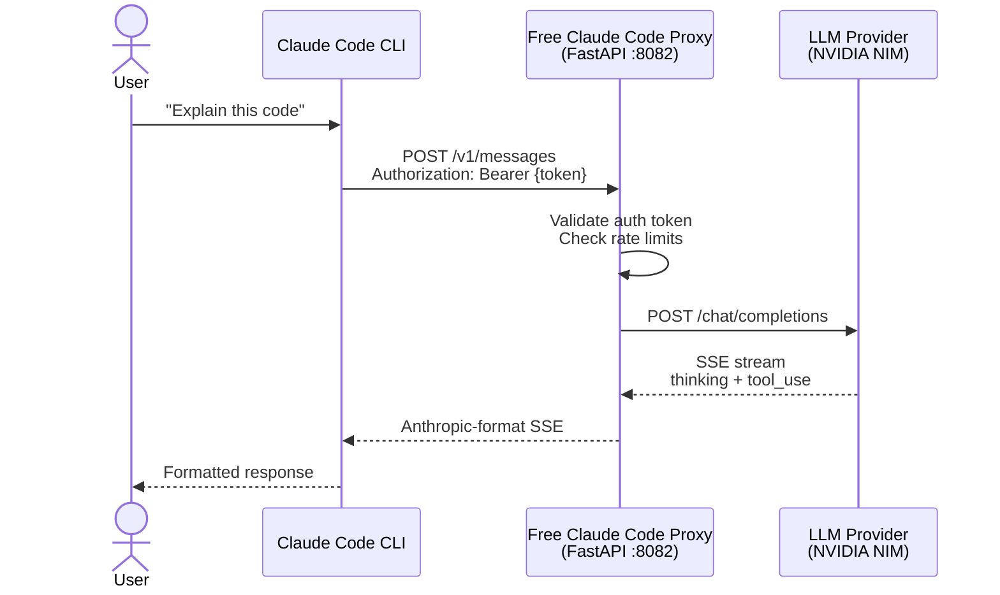

# start — Background Proxy Workflow for Free Claude Code

> Daily-use workflow: run the proxy once in the background, launch Claude Code from any
> directory with `claudex`.


---

## Overview

Upstream FCC runs `fcc-server` in a terminal you keep open (or as a desktop tray app on
Windows and macOS). The Echelix `start` workflow adds a headless alternative:

- **Background server**: `fcc-start` detaches `fcc-server` from the terminal and records its
  PID in `~/.fcc/fcc.pid`.
- **Session persistence**: the proxy survives across many `claudex` invocations and shell
  sessions.
- **Headless**: no prompts, no browser pop-ups (`FCC_OPEN_BROWSER=false` in
  `.env.nvidia.example`); suitable for scripted environments.
- **Managed config**: all settings live in `~/.fcc/.env`, editable via the Admin UI at
  `http://localhost:8082/admin`.

---

## Prerequisites

| Requirement | Version |
| ----------- | ------- |
| Python | 3.14 (installed by uv) |
| uv | ≥ 0.12.13 |
| Claude Code | `npm install -g @anthropic-ai/claude-code` |

---

## Getting Started

### 1. Clone and set up the environment

```bash
git clone https://github.com/Echelix/free-claude-code.git
cd free-claude-code
./start/setup-env.sh
```

`setup-env.sh` installs or updates uv, installs Python 3.14, runs `uv sync`, and offers to
add the `fcc-start`, `fcc-stop`, `fcc-status` and `claudex` aliases to your shell profile.
Windows: `.\start\setup-env.ps1` adds equivalent functions to `$PROFILE`.

### 2. Create the managed config

```bash
mkdir -p ~/.fcc
cp .env.nvidia.example ~/.fcc/.env
```

Edit `~/.fcc/.env`: set `NVIDIA_NIM_API_KEY`, generate `ANTHROPIC_AUTH_TOKEN` with
`openssl rand -base64 32`, and adjust `MODEL_*`. See [README_NVIDIA.md](../README_NVIDIA.md).

> **Security:** keep `PROXY_AUTH_ENABLED=true` with a strong token. The proxy binds to
> `0.0.0.0` by default, so without auth any process on your network can spend your NIM quota.
> Set `HOST=127.0.0.1` if only this machine needs the proxy.

### 3. Run the workflow

```bash
fcc-start      # start the proxy in the background
fcc-status     # check it is running
claudex        # launch Claude Code from any directory
fcc-stop       # stop the proxy when done
```

---

## Workflow Commands

| Command | Description |
| ------- | ----------- |
| `fcc-start` | Spawn `fcc-server` detached; writes `~/.fcc/fcc.pid`; no-op if already running |
| `fcc-status` | Report whether the recorded PID is alive; removes a stale PID file |
| `fcc-stop` | Send SIGTERM (SIGBREAK on Windows) to the recorded PID and remove the PID file |
| `claudex` | Alias of upstream `fcc-claude`: waits for the proxy, injects the auth token and base URL, runs `claude` |

All four are console scripts in `pyproject.toml`. `fcc-start`, `fcc-stop` and `fcc-status`
live in `src/free_claude_code/cli/background.py`.

Logs: `~/.fcc/logs/server.log` (JSON lines). `TRUNCATE_LOG_ON_START=false` keeps them
across restarts.

---

## Scripts in this directory

| Script | Purpose |
| ------ | ------- |
| `setup-env.sh` / `setup-env.ps1` | One-time environment setup and shell aliases |
| `server.sh` / `server.ps1` | Run the proxy in the foreground (`uv run fcc-server`) |
| `run.sh` / `run.ps1` | Launch Claude Code against the proxy (`uv run claudex`) |

---

## Architecture



### Project Structure

```text
free-claude-code/
├── src/free_claude_code/
│   ├── api/            # HTTP routes and request handling
│   ├── application/    # Routing, model catalog, code sessions
│   ├── cli/            # fcc-server, launchers, Echelix background.py
│   ├── config/         # Settings, managed config, paths, model_refs
│   ├── core/           # Anthropic protocol helpers
│   ├── harnesses/      # Client environment policy (Claude, Codex, …)
│   ├── messaging/      # Telegram / Discord bots (disabled by default)
│   ├── providers/      # Provider adapters (nvidia_nim, …)
│   └── runtime/        # Composition root and server lifecycle
├── start/              # This workflow
├── tests/              # Unit and contract tests
└── smoke/              # Live smoke tests
```

---

## Development

```bash
uv sync --all-groups
uv run ruff format
uv run ruff check
uv run ty check
uv run pytest
```

Foreground server for debugging:

```bash
uv run fcc-server
```

---

## License

Proprietary - Echelix
